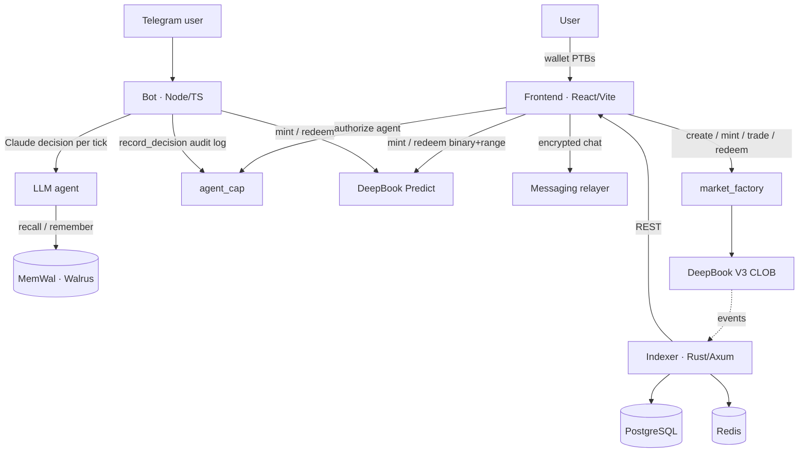

# DeepMarket

**A multi-product prediction market protocol on Sui — built on DeepBook V3 and DeepBook Predict, with an autonomous LLM trading agent.**

DeepMarket has two product lines on top of one Sui Move protocol:

1. **Markets** — create custom `YES`/`NO` outcome markets. Mint outcome tokens, trade them on a DeepBook V3 central limit order book (price = implied probability), and redeem the winning side 1:1 for the quote asset after resolution.
2. **Predict** — DeepBook Predict integration: binary (UP/DOWN) and range options on a live BTC oracle, priced and settled by Mysten's predict vault. A Telegram bot with a Claude-driven agent trades these autonomously on a user's behalf, under an on-chain spend policy.

Built for **Sui Overflow 2026** across the Walrus, Agentic Web, DeepBook, and DeFi & Payments tracks.

> 📚 Full documentation: **https://sui-stack-messaging.onrender.com** (the docs site) — start there for protocol internals, the deployed-IDs table, and the bot/agent design.

## Architecture



## Monorepo layout

| Path | Stack | What it is |
|---|---|---|
| `deepmarket_contract/` | Move 2024.beta | Core protocol — `market_factory`, `yes_token`, `no_token`, `agent_cap`. See its [README](deepmarket_contract/README.md). |
| `deepmarket/` | React + Vite + `@mysten/dapp-kit` | Web app + TypeScript SDK (`src/sdk/`). Markets, Predict, Portfolio, Agent authorize, Stack-Messaging chat. See its [README](deepmarket/README.md). |
| `indexer/` | Rust + Axum | Polls `market_factory` events → PostgreSQL + Redis → REST API (markets, price history, positions). |
| `bot/` | Node + TypeScript | Telegram notifier + autonomous Predict trader + Claude LLM agent + MemWal + AgentCap audit. |
| `docs/` | Nextra | The documentation site. |

## Deployed (Sui testnet)

| Service | URL |
|---|---|
| Frontend | Vercel (see project settings) |
| Indexer API | `https://deepmarket-tusz.onrender.com` |
| Messaging relayer | `https://sui-stack-messaging.onrender.com` |
| Telegram bot | `https://deepmarketbot.onrender.com` |

Key on-chain IDs (testnet — authoritative table in the docs site):

- **DeepMarket package (v3)** — `0x50a58add3954967d6c6480469b9fa78f3f7bb21fed9cda88323cdf7a87771c29`
- **MarketRegistry (shared)** — `0x7e1eee1313ff5f27da5230372eb4560bad4e946bda06878134995203d489eb1d`
- **DeepBook V3 package** — `0x22be4cade64bf2d02412c7e8d0e8beea2f78828b948118d46735315409371a3c`
- **DeepBook Predict package** — `0xf5ea2b3749c65d6e56507cc35388719aadb28f9cab873696a2f8687f5c785138`
- **dUSDC type** — `0xe95040085976bfd54a1a07225cd46c8a2b4e8e2b6732f140a0fc49850ba73e1a::dusdc::DUSDC`

## Quickstart (local dev)

Prerequisites: **Sui CLI**, **Node 20+**, **Rust 1.85+**, **Docker** (for the indexer's Postgres + Redis).

```bash
# 1. Contracts — build + test
cd deepmarket_contract && sui move build && sui move test

# 2. Indexer — Postgres/Redis + API on :3000
cd indexer && docker-compose up -d && cargo run

# 3. Frontend — app on :5173
cd deepmarket && cp .env.example .env && npm install && npm run dev

# 4. Telegram bot (optional) — needs BOT_TOKEN; ANTHROPIC_API_KEY enables the LLM agent
cd bot && npm install && cp .env.example .env && npm run dev
```

See each component's README and `.env.example` for the full environment-variable set.

## Continuous integration

GitHub Actions runs per-stack **verify** workflows (Move build+test, frontend
typecheck+build, indexer fmt+test, bot typecheck+build) and scheduled
**scan** workflows (npm/cargo audit, CodeQL, secret scan). See
`.github/workflows/`.

## License

Hackathon project — see repository for terms.
